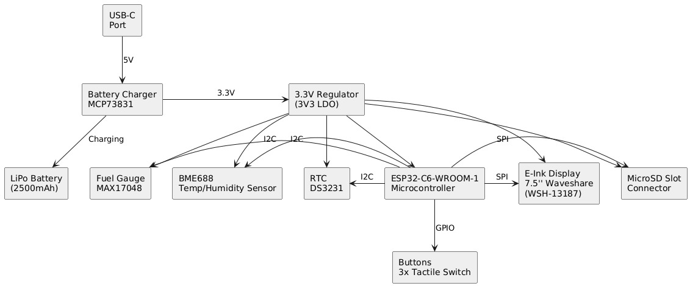

# Nume: Samson Alexandru-Valentin
# Grupa: 332CC

## 1. Descriere Generala:
Obiectivul acestui proiect a fost dezvoltarea unui Ebook Reader accesibil si OpenSource, abordat din punctul de vedere al unui Arhitect de Sistem. Dispozitivul este conceput pentru a putea fi fabricat la scara larga.

Procesul de dezvoltare a inclus etapele standard: crearea schemei electrice, proiectarea layout-ului PCB, modelarea 3D a componentelor si integrarea ansamblului intr-o carcasa.

## 2. Diagrama Bloc

## 3. BOM - Bill of Materials
| Device | Value | Check_Price | Datasheet |
|--------|-------|-------------|-----------|
| ADAFRUIT_LEDCHIP-LED0603 | - | [Link](https://www.snapeda.com/parts/KP-1608SURCK/Kingbright/view-part/?ref=search&t=LED%200603) | [Link](https://www.snapeda.com/parts/KP-1608SURCK/Kingbright/datasheet/) |
| SJ | - | [Link](https://grabcad.com/library/solder-jumpers-1) | - |
| EAGLE-LTSPICE_C | 0.1uF/50V | [Link](https://componentsearchengine.com/part-view/CC0402MRX5R5BB106/YAGEO) | [Link](https://componentsearchengine.com/Datasheets/2/CC0402MRX5R5BB106.pdf) |
| ESP32_WROVER_EAGLE-LTSPICE_R | 0.47 | [Link](https://componentsearchengine.com/part-view/R0402%201%25%20100%20K%20(RC0402FR-07100KL)/YAGEO) | [Link](https://www.yageo.com/upload/media/product/products/datasheet/rchip/PYu-RC_Group_51_RoHS_L_12.pdf) |
| ESP32_WROVER_EAGLE-LTSPICE_R | 100K | [Link](https://componentsearchengine.com/part-view/R0402%201%25%20100%20K%20(RC0402FR-07100KL)/YAGEO) | [Link](https://www.yageo.com/upload/media/product/products/datasheet/rchip/PYu-RC_Group_51_RoHS_L_12.pdf) |
| EAGLE-LTSPICE_C | 100nF | [Link](https://componentsearchengine.com/part-view/CC0402MRX5R5BB106/YAGEO) | [Link](https://componentsearchengine.com/Datasheets/2/CC0402MRX5R5BB106.pdf) |
| RCL_CPOL-EUCT3528 | 100uF TANT | [Link](https://www.snapeda.com/parts/TAJB475K025RNJ/AVX/view-part/?ref=dk&t=capacitor%203528&con_ref=None) | [Link](https://s3.amazonaws.com/snapeda/datasheet/TAJB475K025RNJ_AVX.pdf) |
| ESP32_WROVER_EAGLE-LTSPICE_R | 10K | [Link](https://componentsearchengine.com/part-view/R0402%201%25%20100%20K%20(RC0402FR-07100KL)/YAGEO) | [Link](https://www.yageo.com/upload/media/product/products/datasheet/rchip/PYu-RC_Group_51_RoHS_L_12.pdf) |
| EAGLE-LTSPICE_C | 10uF | [Link](https://componentsearchengine.com/part-view/CC0402MRX5R5BB106/YAGEO) | [Link](https://componentsearchengine.com/Datasheets/2/CC0402MRX5R5BB106.pdf) |
| 112A-TAAR-R03_ATTEND | 112A-TAAR-R03_ATTEND | [Link](https://store.comet.srl.ro/Catalogue/Product/43497/) | [Link](https://store.comet.bg/download-file.php?id=8824) |
| ESP32_WROVER_EAGLE-LTSPICE_R | 15 | [Link](https://componentsearchengine.com/part-view/R0402%201%25%20100%20K%20(RC0402FR-07100KL)/YAGEO) | [Link](https://www.yageo.com/upload/media/product/products/datasheet/rchip/PYu-RC_Group_51_RoHS_L_12.pdf) |
| EAGLE-LTSPICE_C | 1uF | [Link](https://componentsearchengine.com/part-view/CC0402MRX5R5BB106/YAGEO) | [Link](https://componentsearchengine.com/Datasheets/2/CC0402MRX5R5BB106.pdf) |
| EAGLE-LTSPICE_C | 1uF/50V | [Link](https://componentsearchengine.com/part-view/CC0402MRX5R5BB106/YAGEO) | [Link](https://componentsearchengine.com/Datasheets/2/CC0402MRX5R5BB106.pdf) |
| ESP32_WROVER_EAGLE-LTSPICE_R | 2.2 | [Link](https://componentsearchengine.com/part-view/R0402%201%25%20100%20K%20(RC0402FR-07100KL)/YAGEO) | [Link](https://www.yageo.com/upload/media/product/products/datasheet/rchip/PYu-RC_Group_51_RoHS_L_12.pdf) |
| ESP32_WROVER_EAGLE-LTSPICE_R | 200 | [Link](https://componentsearchengine.com/part-view/R0402%201%25%20100%20K%20(RC0402FR-07100KL)/YAGEO) | [Link](https://www.yageo.com/upload/media/product/products/datasheet/rchip/PYu-RC_Group_51_RoHS_L_12.pdf) |
| ESP32_WROVER_SPARKFUN-DISCRETESEMI_MOSFET_PCH-DMG2305UX-7 | 20V/4.2A/52m?/1.4W | [Link](https://componentsearchengine.com/part-view/DMG2305UX-7/Diodes%20Incorporated) | [Link](https://www.diodes.com//assets/Datasheets/DMG2305UX.pdf) |
| ESP32_WROVER_EAGLE-LTSPICE_R | 2K | [Link](https://componentsearchengine.com/part-view/R0402%201%25%20100%20K%20(RC0402FR-07100KL)/YAGEO) | [Link](https://www.yageo.com/upload/media/product/products/datasheet/rchip/PYu-RC_Group_51_RoHS_L_12.pdf) |
| EAGLE-LTSPICE_C | 4.7uF | [Link](https://componentsearchengine.com/part-view/CC0402MRX5R5BB106/YAGEO) | [Link](https://componentsearchengine.com/Datasheets/2/CC0402MRX5R5BB106.pdf) |
| EAGLE-LTSPICE_C | 4.7uF/25V | [Link](https://componentsearchengine.com/part-view/CC0402MRX5R5BB106/YAGEO) | [Link](https://componentsearchengine.com/Datasheets/2/CC0402MRX5R5BB106.pdf) |
| ESP32_WROVER_EAGLE-LTSPICE_R | 5k1 | [Link](https://componentsearchengine.com/part-view/R0402%201%25%20100%20K%20(RC0402FR-07100KL)/YAGEO) | [Link](https://www.yageo.com/upload/media/product/products/datasheet/rchip/PYu-RC_Group_51_RoHS_L_12.pdf) |
| 744043680IND_4828-WE-TPC_WRE | 68uH | [Link](https://ro.mouser.com/ProductDetail/Wurth-Elektronik/744043680?qs=PGXP4M47uW6VkZq%252BkzjrHA%3D%3D&_gl=1*5xajdn*_ga*MzY2ODgyMjE4LjE3NDM2NzQxODk.*_ga_15W4STQT4T*MTc0Mzg3MzkxMy40LjAuMTc0Mzg3MzkxNi41Ny4wLjA.) | [Link](https://www.we-online.com/components/products/datasheet/744043680.pdf) |
| BD5229G-TR | BD5229G-TR | [Link](https://componentsearchengine.com/part-view/BD5229G-TR/ROHM%20Semiconductor) | [Link](https://datasheet.datasheetarchive.com/originals/distributors/Datasheets_SAMA/f2b9741ef86007909f138d561a359946.pdf) |
| ESP32_WROVER_BME680_BME680 | BME688 | [Link](https://www.snapeda.com/parts/BME680/Bosch/view-part/?welcome=home) | [Link](https://www.snapeda.com/parts/BME680/Bosch%20Sensortec/datasheet/) |
| BUTTON_CUSYOMV1V2 | BUTTON_CUSYOMV1V2 | [Link](https://industry.panasonic.com/global/en/products/control/switch/light-touch/number/evqpuj02k) | [Link](https://industry.panasonic.com/global/en/downloads?tab=catalog&small_g_cd=203&part_no=EVQPUJ02K) |
| CPH3225A | CPH3225A | [Link](https://www.snapeda.com/parts/CPH3225A/Seiko+Instruments/view-part/?ref=eda) | [Link](https://www.snapeda.com/parts/CPH3225A/Seiko+Instruments/view-part/?ref=eda ) |
| DS3231SN# | DS3231SN# | [Link](https://www.snapeda.com/parts/DS3231SN%23/Analog+Devices/view-part/?ref=eda) | [Link](https://www.snapeda.com/parts/DS3231SN%23/Analog+Devices/view-part/?ref=eda) |
| ESP32-C6-WROOM-1-N8 | ESP32-C6-WROOM-1-N8 | [Link](https://www.snapeda.com/parts/ESP32-C6-WROOM-1-N8/Espressif+Systems/view-part/?ref=eda) | [Link](https://www.snapeda.com/parts/ESP32-C6-WROOM-1-N8/Espressif+Systems/view-part/?ref=eda) |
| ESP32C6_VARISTORCN1812 | ESP32C6_VARISTORCN1812 | [Link](https://www.mouser.co.uk/ProductDetail/EPCOS-TDK/B72520T0350K062?qs=dEfas%2FXlABIszF52uu7vrg%3D%3D) | [Link](https://www.tdk-electronics.tdk.com/inf/75/db/CTVS_14/Surge_protection_series.pdf) |
| ESP32_WROVER_SPARKFUN-IC-POWER_MCP73831 | ESP32_WROVER_SPARKFUN-IC-POWER_MCP73831 | [Link](https://ro.mouser.com/ProductDetail/Microchip-Technology/MCP73831T-2ACI-OT?qs=yUQqVecv4qvbBQBGbHx0Mw%3D%3D) | [Link](https://ro.mouser.com/datasheet/2/268/MCP73831_Family_Data_Sheet_DS20001984H-3441711.pdf) |
| FH34SRJ-24S-0.5SH_99_ | FH34SRJ-24S-0.5SH_99_ | [Link](https://componentsearchengine.com/part-view/FH34SRJ-24S-0.5SH(99)/Hirose) | [Link](https://www.hirose.com/en/product/document?clcode=CL0580-1255-6-99&productname=FH34SRJ-24S-0.5SH(99)&series=FH34SRJ&documenttype=2DDrawing&lang=en&documentid=0000990903) |
| MAX17048G+T10 | MAX17048G+T10 | [Link](https://www.snapeda.com/parts/MAX17048G+T10/Analog+Devices/view-part/?ref=eda) | [Link](https://www.snapeda.com/parts/MAX17048G+T10/Analog+Devices/view-part/?ref=eda) |
| MBR0530. | MBR0530. | [Link](https://www.snapeda.com/parts/MBR0530/Onsemi/view-part/?ref=eda) | [Link](https://www.snapeda.com/parts/MBR0530/ON%20Semiconductor/datasheet/) |
| PGB1010603MR. | PGB1010603MR. | [Link](https://www.snapeda.com/parts/PGB1010603MR/Littelfuse/view-part/?ref=eda) | [Link](https://www.snapeda.com/parts/PGB1010603MR/Littelfuse%20Inc./datasheet/) |
| QWIIC_CONNECTORJS-1MM | QWIIC_RIGHT_ANGLE | [Link](https://www.digikey.lt/en/models/926710 ) | [Link](https://www.digikey.lt/en/models/926710) |
| SAMACSYS_PARTS_USB4110-GF-A | SAMACSYS_PARTS_USB4110-GF-A | [Link](https://componentsearchengine.com/part-view/USB4110-GF-A/GCT%20(GLOBAL%20CONNECTOR%20TECHNOLOGY)) | [Link](https://gct.co/files/drawings/usb4110.pdf) |
| ESP32_WROVER_AVX---SD0805S020S1R0_AVX_SD0805S020S1R0_0_0AVX_SD0805S020S1R0_0_0 | SD0805S020S1R0 | [Link](https://ro.mouser.com/ProductDetail/KYOCERA-AVX/SD0805S020S1R0?qs=jCA%252BPfw4LHbpkAoSnwrdjw%3D%3D) | [Link](http://datasheets.avx.com/schottky.pdf) |
| SI1308EDL-T1-GE3 | SI1308EDL-T1-GE3 | [Link](https://www.snapeda.com/parts/SI1308EDL-T1-GE3/Vishay+Siliconix/view-part/?ref=eda) | [Link](https://www.snapeda.com/parts/SI1308EDL-T1-GE3/Vishay+Siliconix/view-part/?ref=eda) |
| TPV1 | TPV1 | Custom made | - |
| USBLC6-2SC6Y | USBLC6-2SC6Y | [Link](https://www.snapeda.com/parts/USBLC6-2SC6Y/STMicroelectronics/view-part/?ref=eda) | [Link](https://www.snapeda.com/parts/USBLC6-2SC6Y/STMicroelectronics/view-part/?ref=eda) |
| W25Q512JVEIQ | W25Q512JVEIQ | [Link](https://www.snapeda.com/parts/W25Q512JVEIQ/Winbond+Electronics/view-part/?ref=eda) | [Link](https://www.snapeda.com/parts/W25Q512JVEIQ/Winbond+Electronics/view-part/?ref=eda) |
| XC6220A331MR-G | XC6220A331MR-G | [Link](https://componentsearchengine.com/part-view/XC6220A331MR-G/Torex) | [Link](https://product.torexsemi.com/system/files/series/xc6220.pdf) |

## 4. Arhitectura Hardware

Mai jos sunt detaliate componentele hardware esentiale si rolul lor in functionarea dispozitivului:

| Nr. | Componenta Principala                   |
|-----|------------------------------------------|
| 1   | Microcontroller – ESP32-C6-WROOM-1       |
| 2   | Ecran E-Ink – Waveshare WSH-13187, 7.5”  |
| 3   | Senzor Ambiental – Bosch BME688          |
| 4   | Sistem de Alimentare si Baterie          |
| 5   | Butoane de Control – 3x Tactile Switch   |
| 6   | Conector USB-C                           |
| 7   | Port Extensie Qwiic / STEMMA QT (I2C)    |
| 8   | Soclu MicroSD – Attend 112A-TAAR-R03     |
| 9   | Ceas Timp Real (RTC) – DS3231            |

### 4.1. Unitatea Centrala – Microcontroller ESP32-C6-WROOM-1

-   **Unitate de Procesare:** RISC-V 32-bit, frecventa 160MHz
-   **Memorie:** 512KB SRAM intern + 8MB memorie flash extern (model W25Q512JVEIQ)
-   **Optiuni de Comunicare:** Wi-Fi 6 (standard 802.11ax), Bluetooth 5 LE, interfata USB 2.0 Full-Speed
-   **Interfete Disponibile:** SPI, I2C, UART, multiple porturi GPIO
-   **Consum Energetic:** Sub 50µA in modul deep sleep; diverse moduri de consum redus implementate
-   **Functii de Securitate:** Include secure boot, criptare pentru memoria flash si accelerare hardware pentru criptografie

### 4.2. Afisajul Electronic – Ecran E-Ink Waveshare WSH-13187, 7.5”

-   **Rezolutie:** 800x480 pixeli, imagine monocroma
-   **Modalitate de Conectare:** Interfata SPI (4 fire) plus linii de control CS, DC, RST, BUSY
-   **Consum Energetic:** Aproximativ 15–25mA in timpul actualizarii imaginii; consum neglijabil in stare statica
-   **Motivul alegerii:** Consum de energie neglijabil cand imaginea este statica, ideal pentru un e-reader

### 4.3. Senzorul Ambiental Integrat – Bosch BME688

-   **Parametri Masurati:** Temperatura, Umiditate relativa, Presiune atmosferica, Indice al Calitatii Aerului (estimare eCO2, TVOC)
-   **Acuratete:** ±1°C pentru temperatura, ±3% pentru umiditate, ±1 hPa pentru presiune
-   **Modalitate de Conectare:** Interfata I2C (operare la 400kHz)
-   **Consum Energetic:** 2.1µA in standby, maxim 3.6mA in timpul masuratorilor active
-   **Motivul alegerii:** Solutie compacta multi-senzor, potrivita pentru monitorizarea conditiilor ambientale

### 4.4. Sistemul de Alimentare si Gestionarea Energiei

-   **Sursa de Energie:** Acumulator Li-Po de 3.7V cu o capacitate de 2500mAh
-   **Monitorizare Baterie:** Circuit integrat MAX17048 (comunica prin I2C)
-   **Circuit de Incarcare:** MCP73831 – permite incarcarea cu 5V/1A via portul USB-C
-   **Regulator de Tensiune:** LDO ce furnizeaza o tensiune stabila de 3.3V pentru intregul circuit
-   **Consum Total Estimativ:**
    -   In mod activ: intre 100 si 150mA
    -   In mod deep sleep: sub 50µA

### 4.5. Interfata cu Utilizatorul – 3x Butoane Tactile

-   **Model Buton:** Panasonic EVQ-Q2A03W
-   **Conectare Electrica:** Legate la pini GPIO, cu circuit de debounce hardware (filtru RC)
-   **Functionalitati Asignate:** Navigare prin meniuri, avansare/revenire pagina, confirmare actiuni

### 4.6. Conectorul USB-C

-   **Functionalitati Principale:** Incarcarea bateriei si transferul de date (conform standardului USB 2.0)
-   **Masuri de Protectie:** Protectie ESD integrata si terminatii conforme standardului
-   **Posibilitati Suplimentare:** Actualizari software OTA (Over-The-Air) via Wi-Fi sau actualizare firmware prin conexiune USB

### 4.7. Portul de Extensie Qwiic / STEMMA QT (I2C)

-   **Configuratie Pini:** VCC (Alimentare), GND (Masa), SDA (Date I2C), SCL (Ceas I2C)
-   **Scop/Beneficii:** Permite conectarea rapida a modulelor si senzorilor externi compatibili I2C

### 4.8. Soclul pentru Card MicroSD – Attend 112A-TAAR-R03

-   **Rol Principal:** Ofera spatiu de stocare extern (pentru carti electronice, fisiere jurnal, firmware etc.)
-   **Modalitate de Conectare:** Interfata SPI

### 4.9. Ceasul Timp Real (RTC) – DS3231

-   **Acuratete:** Deviatie maxima de ±2 parti per milion (ppm)
-   **Modalitate de Conectare:** Interfata I2C
-   **Alimentare de Backup:** Asigurata de un supercapacitor

---

### Protocoale de Comunicare si Interfete Utilizate

| Protocol/Interfata | Componente Conectate                                |
|--------------------|-----------------------------------------------------|
| **SPI**            | Ecran E-Paper, Memorie Flash externa, Card SD (SPI) |
| **I2C**            | Senzor BME688, Fuel Gauge MAX17048, RTC DS3231, Port Qwiic/Stemma |
| **USB**            | Incarcare si comunicatie de date via USB-C         |
| **GPIO**           | Butoane, Linii control afisaj, Activare incarcare   |

---

### Profil de Consum Energetic (Estimari)

| Stare/Componenta       | Consum Estimativ   |
|------------------------|--------------------|
| ESP32-C6 (mod activ)   | 80–100mA           |
| Actualizare E-Paper    | 15–25mA            |
| Senzor BME688 (activ)  | 3.6mA              |
| Fuel Gauge MAX17048    | ~50µA              |
| RTC DS3231             | 3.5mA / 1µA backup |
| Deep Sleep (Total)     | <50–100µA          |

---

### Specificatii Fizice si Constructive

-   **Marimi Fizice:** 175 x 114 x 10 mm
-   **Masa Dispozitivului:** Aproximativ 250g
-   **Material Carcasa:** ABS sau policarbonat, cu design ergonomic
-   **Montare Afisaj:** Integrat intr-un decupaj specific al carcasei
-   **Detalii de Fabricatie:** PCB cu 2 straturi, finisaj ENIG, carcasa obtinuta prin injectie de plastic

## 5. Pini utilizati pe ESP32-C6 si justificare

| Pin ESP32-C6 | Componenta / Semnal                | Justificare                                                              |
|--------------|-------------------------------------|--------------------------------------------------------------------------|
| GPIO1        | I2C SDA (BME688, MAX17048, DS3231, Qwiic) | Linie partajata I2C - economiseste pini si permite extinderea usoara a sistemului |
| GPIO2        | I2C SCL (BME688, MAX17048, DS3231, Qwiic) | Semnal de ceas I2C pentru toti senzorii si portul de extensie Qwiic     |
| GPIO5        | SPI MISO (E-Paper, Flash extern)    | Linie comuna de intrare date (Master In Slave Out) pentru SPI            |
| GPIO6        | SPI MOSI (E-Paper, Flash extern)    | Linie comuna de iesire date (Master Out Slave In) pentru SPI             |
| GPIO7        | SPI CLK                             | Semnal de ceas (Clock) pentru magistrala SPI                             |
| GPIO8        | E-Paper CS                          | Selecteaza (Chip Select) ecranul E-Paper pe magistrala SPI                |
| GPIO9        | E-Paper DC (Data/Command)           | Comuta intre modul de comanda si modul de date pentru E-Paper            |
| GPIO10       | E-Paper RST                         | Linie de reset hardware pentru ecranul E-Paper                           |
| GPIO11       | E-Paper BUSY                        | Indica starea display-ului (ocupat/liber)                                |
| GPIO12       | Button #1                           | Intrare digitala pentru butonul de navigare (ex: pagina inainte)         |
| GPIO13       | Button #2                           | Intrare digitala pentru butonul de navigare (ex: pagina inapoi)          |
| GPIO14       | Button #3                           | Intrare digitala pentru butonul de selectie sau optiuni                 |
| GPIO15       | MAX17048 ALERT (optional)           | Pin optional pentru alerta de nivel scazut al bateriei de la MAX17048     |
| GPIO16       | USB D+ (intern la USB PHY)          | Linie de date pozitiva USB 2.0 (pin dedicat pe ESP32-C6)                 |
| GPIO17       | USB D- (intern la USB PHY)          | Linie de date negativa USB 2.0 (pin dedicat pe ESP32-C6)                 |
| GPIO18       | LED Status (optional)               | Iesire pentru un LED de stare (ex: activitate Wi-Fi, incarcare, etc.)    |
| GPIO19       | SD Card CS                          | Selectare (Chip Select) pentru cardul microSD pe magistrala SPI           |
| GPIO20       | SD Card MISO                        | Linie de citire date (Master In Slave Out) de pe cardul microSD         |
| GPIO21       | SD Card MOSI                        | Linie de scriere date (Master Out Slave In) pe cardul microSD           |
| GPIO4        | SD Card CLK                         | Semnal de ceas (Clock) pentru cardul microSD (SPI)                       |

## 6. Probleme Intampinate
1) In etapa de modelare 3D, a aparut o dificultate majora: modelele 3D pentru rezistente si condensatoare nu se actualizau automat in proiectul PCB la utilizarea functiei 'Replace Package'. Solutia a fost adaugarea manuala a modelelor 3D personalizate pentru fiecare dintre aceste componente.

2) Dimensiunea pad-urilor pentru bobina si conectorul USB, asa cum erau definite initial in footprint, s-a dovedit a fi insuficienta pentru grosimea terminalelor/pinilor. A fost necesara marirea manuala a acestor pad-uri in footprint pentru a facilita procesul de lipire.

## 7. Observatii
Un proiect cu un volum de munca foarte mare, care in opinia mea depaseste valoarea de 2 puncte din nota finala. Timp estimat de lucru: ~80 ore.